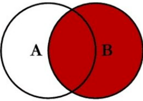

# 5. Relações Entre Tabelas

A cláusula `JOIN` em SQL, correspondente a uma operação de junção em álgebra relacional, combina colunas de uma ou mais tabelas em um banco de dados relacional. Essa operação cria um conjunto que pode ser salvo como uma tabela ou utilizado diretamente.

Um `JOIN` permite combinar colunas de uma (auto-junção) ou mais tabelas, utilizando valores comuns a cada uma delas. O SQL padrão especifica quatro tipos de `JOIN`: `INNER JOIN`, `LEFT JOIN`, `RIGHT JOIN` e `FULL JOIN`.

## 5.1. INNER JOIN

A cláusula `INNER JOIN` compara cada linha da tabela A com as linhas da tabela B para encontrar todos os pares de linhas que satisfazem a condição de junção. Se a condição for avaliada como verdadeira (TRUE), os valores das colunas correspondentes das tabelas A e B são combinados em uma nova linha e incluídos no conjunto de resultados. A Figura 5.1 a seguir ilustra a cláusula `INNER JOIN` por meio de um diagrama de Venn.

<div align="center">
    
    <p>Figura 5.1: Cláusula INNER JOIN.</p>
</div>

**Exemplo de INNER JOIN:**

```
SELECT a.coluna1, b.coluna2
FROM tabela_a a
INNER JOIN tabela_b b ON a.id = b.a_id;
```

## 5.2. LEFT JOIN

A cláusula `LEFT JOIN` retorna todos os registros da tabela à esquerda e os registros correspondentes da tabela à direita. Se uma linha da tabela esquerda não tiver correspondência na tabela direita, os valores das colunas da tabela direita serão retornados como NULL. A Figura 5.2 a seguir ilustra a cláusula `LEFT JOIN` por meio de um diagrama de Venn.

<div align="center">
    
    <p>Figura 5.2: Cláusula LEFT JOIN.</p>
</div>

**Exemplo de LEFT JOIN:**

```
SELECT a.coluna1, b.coluna2
FROM tabela_a a
LEFT JOIN tabela_b b ON a.id = b.a_id;
```

## 5.3. RIGHT JOIN

A cláusula `RIGHT JOIN` retorna todos os registros da tabela à direita e os registros correspondentes da tabela à esquerda. Se uma linha da tabela direita não tiver correspondência na tabela esquerda, os valores das colunas da tabela esquerda serão retornados como NULL. A Figura 5.3 a seguir ilustra a cláusula `RIGHT JOIN` por meio de um diagrama de Venn.

<div align="center">
    
    <p>Figura 5.3: Cláusula RIGHT JOIN.</p>
</div>