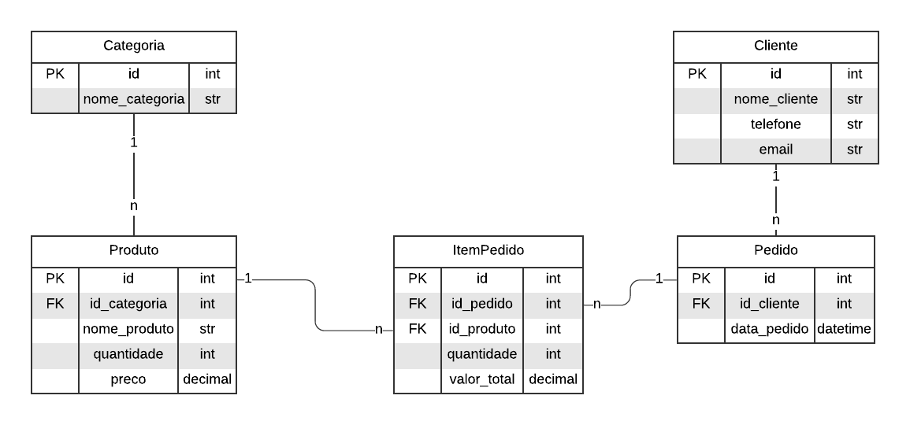

# 14. Projeto

O projeto tem como objetivo desenvolver um sistema de gestão de pedidos utilizando PostgreSQL como banco de dados. A Figura 14.1 a seguir demonstra o modelo relacional do sistema, composto por cinco tabelas principais que descrevem as entidades envolvidas e seus relacionamentos.

<div align="center">
    
    <p>Figura 14.1: Modelo relacional.</p>
</div>

## 14.1. Descrição do Modelo Relacional

1. **Categoria:**
Representa as categorias dos produtos. Cada categoria possui um identificador único (`id`) e um nome (`nome_categoria`). Uma categoria pode estar associada a vários produtos.

2. **Produto:**
Armazena os produtos disponíveis no sistema. Cada produto é identificado por um `id` e contém informações como nome (`nome_produto`), quantidade disponível (`quantidade`), preço (`preco`) e a categoria a que pertence (`id_categoria`), referenciada pela tabela `Categoria`.

3. **Cliente:**
Registra os clientes do sistema. Cada cliente possui um identificador único (`id`), nome (`nome_cliente`), telefone (`telefone`) e email (`email`). Um cliente pode realizar vários pedidos.

4. **Pedido:**
Representa os pedidos realizados pelos clientes. Cada pedido é identificado por um `id`, está relacionado a um cliente (`id_cliente`) e contém a data do pedido (`data_pedido`). Um pedido pode conter vários itens.

5. **ItemPedido:**
Detalha os itens de um pedido. Cada item é identificado por um `id` e está associado a um pedido (`id_pedido`) e a um produto (`id_produto`). Além disso, contém informações como a quantidade do produto no pedido (`quantidade`) e o valor total do item (`valor_total`).

## 14.2. Relacionamentos

- A tabela `Categoria` está relacionada à tabela `Produto` em uma relação 1:n.
- A tabela `Produto` está associada à tabela `ItemPedido` em uma relação 1:n.
- A tabela `Cliente` está associada à tabela `Pedido` uma relação 1:n.
- A tabela `Pedido` está associada à tabela `ItemPedido` em uma relação 1:n.

## 14.3. Implementação

A implementação do sistema de gestão de pedidos foi projetada para uma loja de produtos eletrônicos. O banco de dados será desenvolvido utilizando PostgreSQL, um sistema de gerenciamento de banco de dados relacional robusto e amplamente utilizado. As tabelas foram definidas com base no modelo relacional apresentado. O banco de dados será criado a partir do comando SQL a seguir, que estabelece sua estrutura inicial.

```
CREATE DATABASE sistema_pedidos;
```

O script a seguir define a estrutura do banco de dados para o sistema de gestão de pedidos. Ele cria as tabelas principais e estabelece os relacionamentos entre elas, conforme especificado no modelo relacional. A definição inclui chaves primárias e estrangeiras, garantindo a integridade referencial e a consistência dos dados.

```
/* Criar tabela categoria */
CREATE TABLE categoria (
    id SERIAL PRIMARY KEY,
    nome_categoria VARCHAR(50) NOT NULL
);

/* Criar tabela produto */
CREATE TABLE produto (
    id SERIAL PRIMARY KEY,
    nome_produto VARCHAR(50) NOT NULL,
    quantidade INTEGER NOT NULL,
    preco DECIMAL(10, 2) NOT NULL,
    id_categoria INTEGER,
    FOREIGN KEY (id_categoria) REFERENCES categoria(id)
);

/* Criar tabela cliente */
CREATE TABLE cliente (
    id SERIAL PRIMARY KEY,
    nome_cliente VARCHAR(100) NOT NULL,
    telefone VARCHAR(15) NOT NULL,
    email VARCHAR(100) NOT NULL
);

/* Criar tabela pedido */
CREATE TABLE pedido (
    id SERIAL PRIMARY KEY,
    data_pedido timestamptz NOT NULL,
    id_cliente INTEGER,
    FOREIGN KEY (id_cliente) REFERENCES cliente(id)
);

/* Criar tabela item_pedido */
CREATE TABLE item_pedido (
    id SERIAL PRIMARY KEY,
    quantidade INTEGER NOT NULL,
    preco DECIMAL NOT NULL,
	id_pedido INTEGER,
	id_produto INTEGER,
    FOREIGN KEY (id_pedido) REFERENCES pedido(id),
	FOREIGN KEY (id_produto) REFERENCES produto(id)
);
```